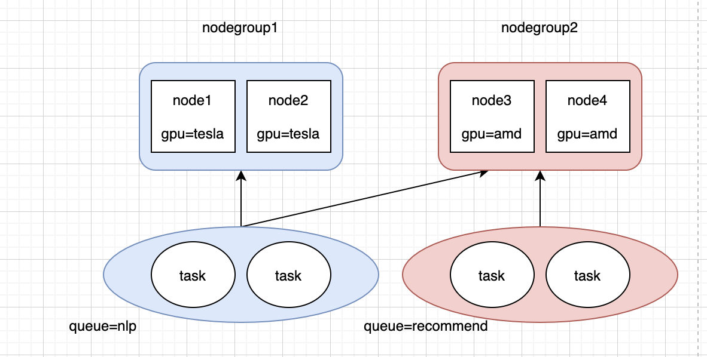
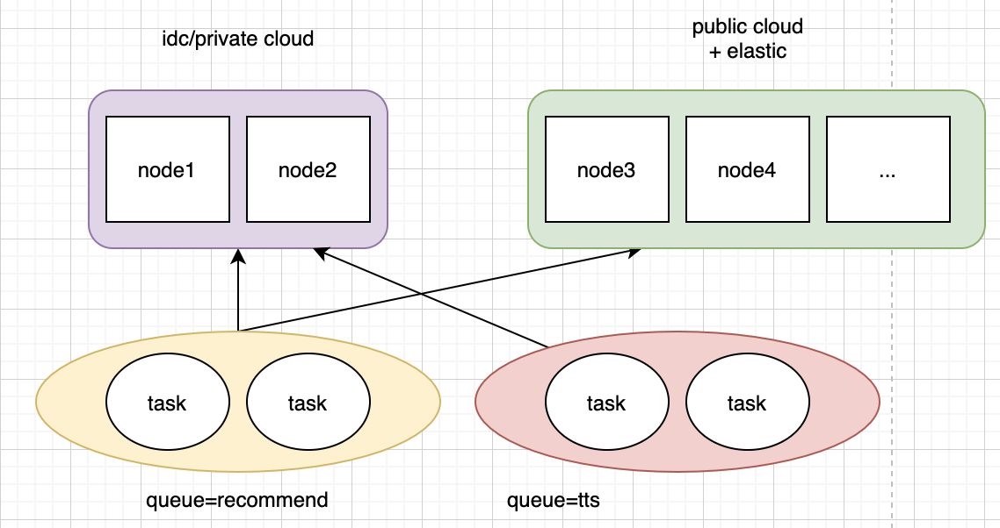

## Introduction

nodegroup is the nodes with the same specified label, on the basis of nodegroup, different queues and nodegroups have some relationship about affinity and anti-affinity.

case1: different departments (like nlp and recommend) use different nodes (nodegroup1 and nodegroup2), nlp queue uses nodegroup1 first, and nodegroup2 can also be used when resources are insufficient, but recommend queue can only use nodegroup2.



case2: recommend queue can use private cloud nodes or public cloud nodes, but tts queue can only use private cloud nodes because its task takes a long time, which is not easy to the release of nodes in public cloud (for saving money)



## Solution

1. First, we need mark out some nodes(add `volcano.sh/nodegroup-name` labels) which are the same group.
2. Second, we need to express the relationship between queue and nodegroup, such as affinity and anti-affinity, so I add the `queue.spec.affinity` field in Queue.
   ```yaml
   apiVersion: scheduling.volcano.sh/v1beta1
   kind: Queue
   metadata:
     name: default
     spec:
       reclaimable: true
       weight: 1
       affinity:            # added field
         nodeGroupAffinity:
           requiredDuringSchedulingIgnoredDuringExecution:
           - groupname1
           - gropuname2
           preferredDuringSchedulingIgnoredDuringExecution:
           - groupname1
         nodeGroupAntiAffinity:
           requiredDuringSchedulingIgnoredDuringExecution:
           - groupname3
           - gropuname4
           preferredDuringSchedulingIgnoredDuringExecution:
           - groupname3
   ```

affinity configure:
1. affinity.nodeGroupAffinity.requiredDuringSchedulingIgnoredDuringExecution, hard constraints, such as `nlp = nodegroup1,nodegroup2`, it means that task in queue=nlp can ony run on the nodes in nodegroup1 or nodegroup2.
2. affinity.nodeGroupAffinity.preferredDuringSchedulingIgnoredDuringExecution, soft constraints, such as `nlp = nodegroup1`, it means that task in queue=nlp runs on nodegroup1 first, but if the resources of nodegroup1 is insufficient, it can also run on other nodegroups.
3. affinity.nodeGroupAntiAffinity.requiredDuringSchedulingIgnoredDuringExecution, hard constraints, such as `nlp = nodegroup1`, it means that task in queue=nlp can run on any nodegroups but nodegroup1.
4. affinity.nodeGroupAntiAffinity.preferredDuringSchedulingIgnoredDuringExecution, soft constraints, such as `nlp = nodegroup1`, it means that task in queue=nlp runs on any other nodegroups, but if the resources of other nodegroup is insufficient, it can also run on nodegroup1.

we also need to enable nodegroup plugin.

```yaml
actions: "reclaim, allocate, backfill, preempt"
tiers:
- plugins:
  - name: priority
  - name: gang
  - name: conformance
- plugins:
  - name: drf
  - name: predicates
  - name: proportion
  - name: nodegroup
    enablePredicate: true
    enableNodeOrder: true
```

risk: The resources of the queue can not be too different from the resources of the nodegroup(such as queue.capability.memory = 1024G,but all the memory of binding nodegroup is 512G), otherwise it may cause that task can be scheduled to run from the queue's point of view, but cannot find a suitable node.

## Implement

Hard constraints are implemented by using PredicateFn, and soft constraints are implemented by using NodeOrderFn.
